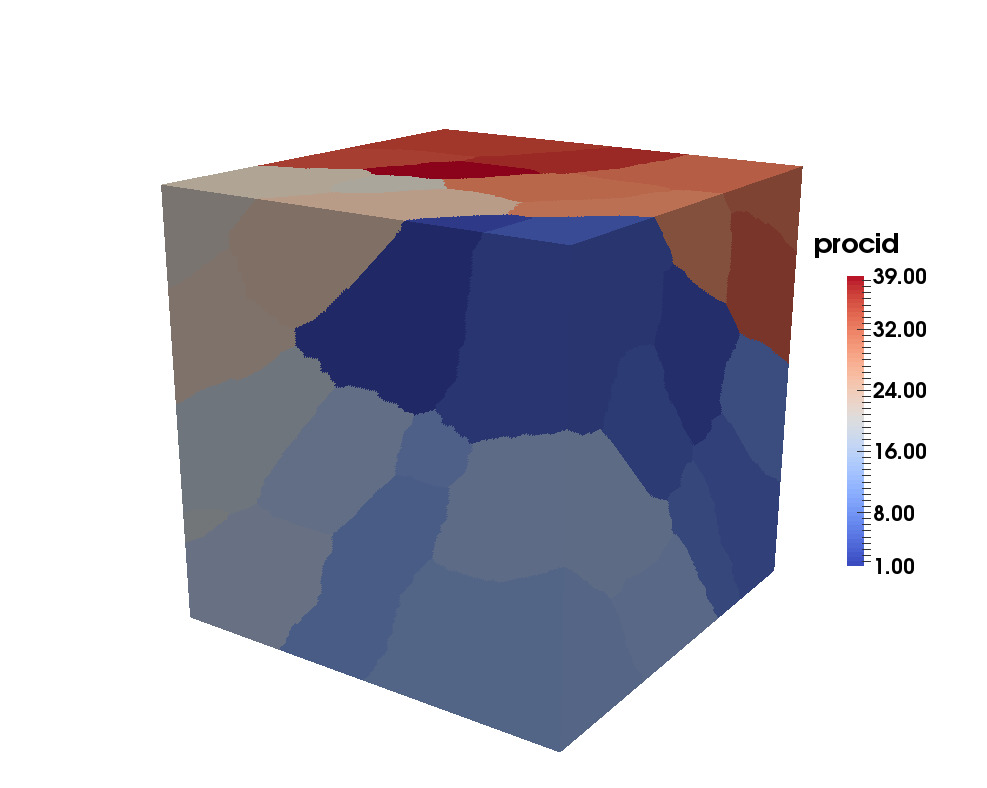
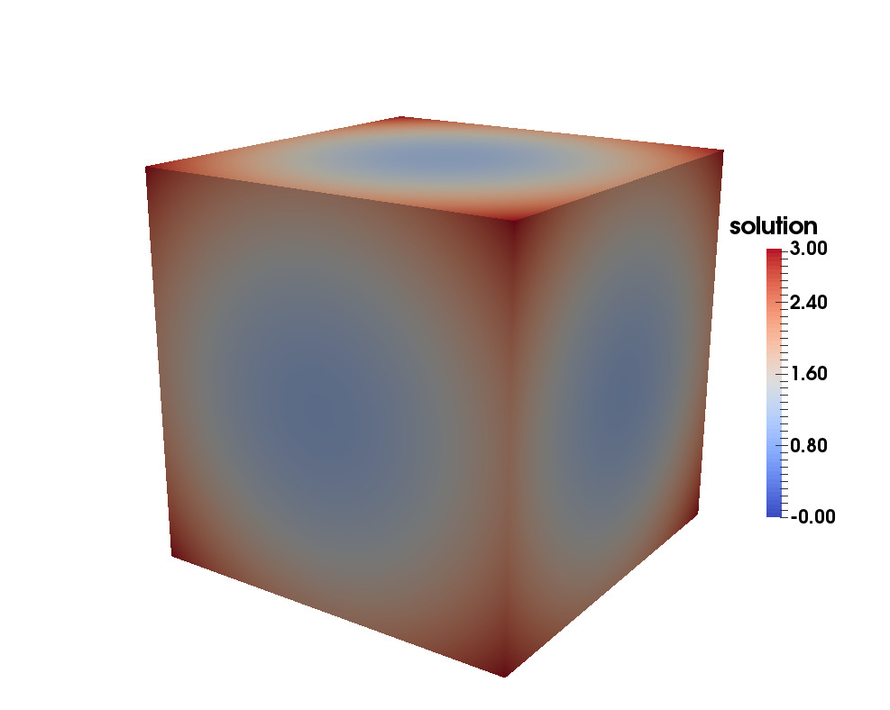
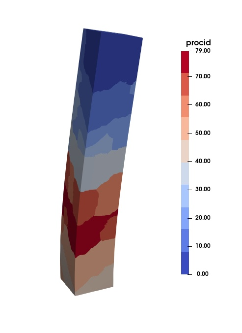
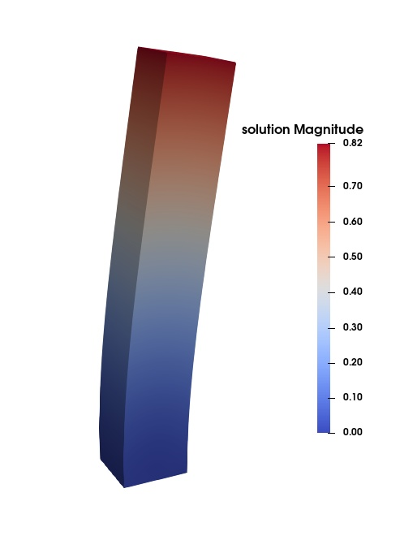

# ParallelFEM-Fortran
Parallel programming for Finite Element Analysis using FORTRAN and PETSc

This code includes several parallel implementations for the Lapalace equation and linear elasticity in 2D and 3D. This code has been tested on HPC machines at Swansea University.

Please report if you find any issues/bugs.

## Compilation steps
* Enter `bin` directory using `cd bin`
* Modify the makefile as per the location of the PETSc library files in your system
* Execute `make <exename>`. This will also compile all the dependencies.
* For example, to build `tetrapoissonparallelimpl1` use the command `make tetrapoissonparallelimpl1`

## Step-by-step guide
Refer to the [PDF](https://www.researchgate.net/publication/336013767_Parallel_programming_for_Finite_Element_Analysis_-a_step-by-step_guide) for the details on data structures and some discussion on the parallel programming for FEA.

## Some examples
### Poisson equation in 3D with 200x200x200x6 (= 48 Million) tetrahedral elements

### Linear elasticity in 3D with 50x300x50x6 (= 4.5 Million) tetrahedral elements

